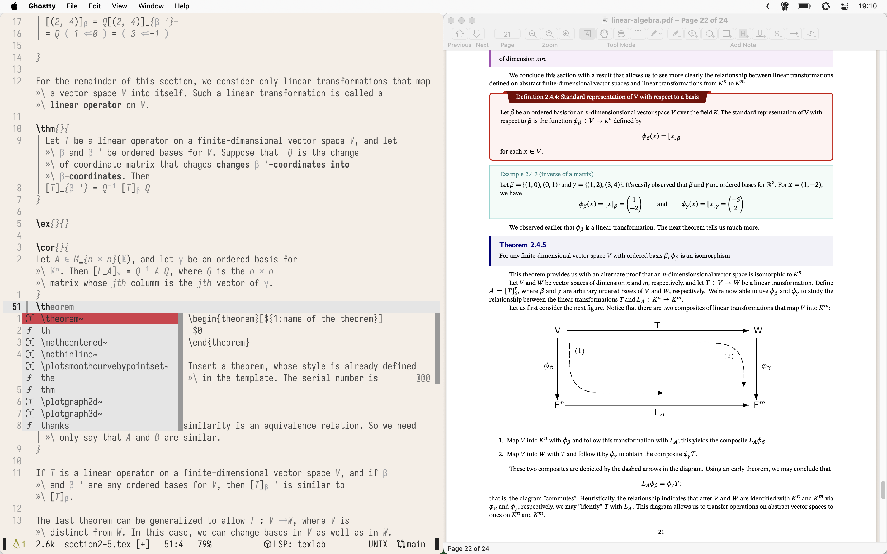

# Comp. Sci. Notes

This directory contains my computer science notes, organized by subject. Each subject is a separate LaTeX project with a modular structure for easy management and compilation.

## Structure

- `automata/`: Notes and homework for Automata, including assignments.
- `linear-algebra/`: Linear Algebra notes, organized into chapters and sections.
  - `chapters/`: Contains chapter files (e.g., `chapter1.tex`, `chapter2.tex`).
  - `sections/`: Contains section files for each chapter (e.g., `section1-1.tex`).
  - `linear-algebra.tex`: The main LaTeX file for this subject.
- `probability/`: Probability notes.
- `template/`: A general LaTeX template with shared files (e.g., `preamble.tex`, `macros.tex`) that can be reused across subjects.

## Usage

Each subject directory contains a main `.tex` file (e.g., `linear-algebra.tex`, `tarea5.tex`) that can be compiled with LaTeX. I use VimTeX with Neovim for continuous compilation while editing.
